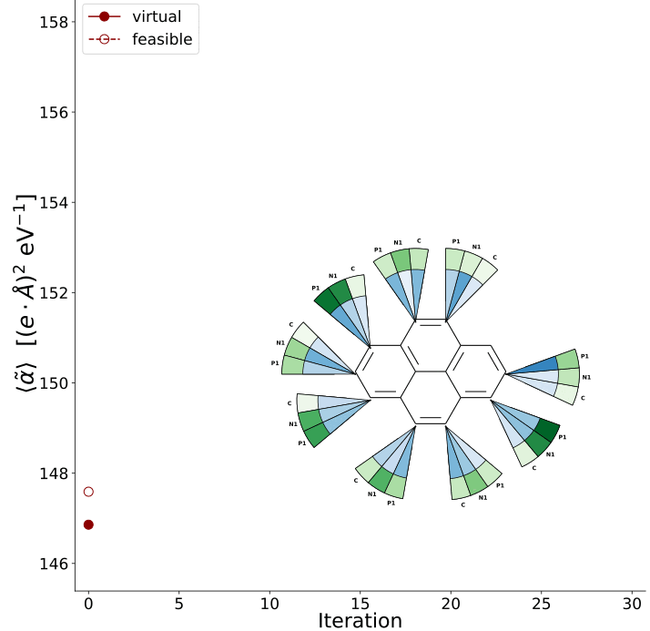

# Molecule inverse design with automatic differentiation: Hückel + JAX

Using JAX we optimize the type of atoms given an adjacency matrix of a molecular graph and the target observable. All observables were computed with the Hückel model.


Otpimization of HOMO-LUMO gap ($\epsilon_{HL}$), and polarizability ($\langle \alpha\rangle$),
<p align="center">


</p>

Our code only considers three different **optimizers**,

1. BFGS
2. Gradient descent
3. Adam
   
To extended to other optimization methods, check `wrapper_opt_method` in `huxel/minimize.py`.


# Example (benzene)

## Adjacency matrix for benzene

```python:
    import jax.numpy as jnp

    from huxel.molecule import myMolecule
    from huxel.optimization_inversemol import _optimization_molec as _opt

    atom_types = ["X", "X", "X", "X", "X", "X"]
    smile = "C6" #name label

    connectivity_matrix = jnp.array(
        [
            [0, 1, 0, 0, 0, 1],
            [1, 0, 1, 0, 0, 0],
            [0, 1, 0, 1, 0, 0],
            [0, 0, 1, 0, 1, 0],
            [0, 0, 0, 1, 0, 1],
            [1, 0, 0, 0, 1, 0],
        ],
        dtype=int,
    )

    xyz = jnp.array([[ 1.40000000e+00,  3.70074342e-17,  0.00000000e+00],
       [ 7.00000000e-01, -1.21243557e+00,  0.00000000e+00],
       [-7.00000000e-01, -1.21243557e+00,  0.00000000e+00],
       [-1.40000000e+00,  2.08457986e-16,  0.00000000e+00],
       [-7.00000000e-01,  1.21243557e+00,  0.00000000e+00],
       [ 7.00000000e-01,  1.21243557e+00,  0.00000000e+00]])

    molec = myMolecule(
        "benzene",
        smile,
        atom_types,
        connectivity_matrix,
        xyz
    )

    l = 0 # jax.random.PRNGKey(l)
    _opt(l, molec,'homo_lumo','BFGS')
```

## Optimization of different molecules

We considered eight different molecules.
<p align="center">

</p>

execute `run_molecule_i.py` where the options are,

1. `--l`, integer (to initialize `jax.random.PRNGKey(l)`)
2. `--s`, integer for smile data set (range [1, ..., 8])
3. `--obj`, objective to optimize options [homo_lumo,polarizability]
4. `--opt`, optimization method [adam,GD,BFGS]
5. `--extfield`, external field magnitude (only for polarizability)


## Requirments

```
jax, optax, jaxopt
```

## Paper